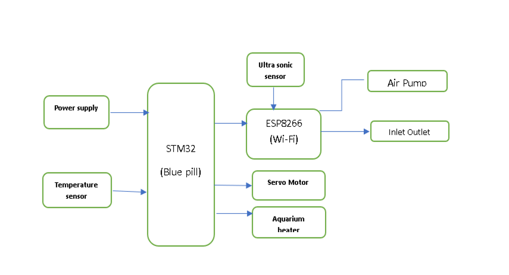
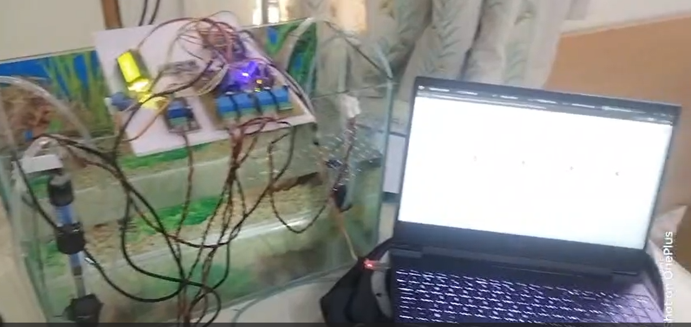

<h1>🐠 Automatic Aquarium</h1>
<h3>A Hybrid STM32 + ESP8266 Based Smart Aquarium Automation System</h3>

<strong>Capstone Project – Electronics & Telecommunication Engineering</strong> 
Rajarambapu Institute of Technology, Rajaramnagar (2025–26)

<h2>📘 Overview</h2>

The <strong>Automatic Aquarium</strong> is an automation system designed to maintain
stable aquatic environments using a combination of real-time embedded control
and IoT remote monitoring.

<ul>
    <li><strong>STM32F103C8</strong> – Time-critical control & sensor handling</li>
    <li><strong>ESP8266 WiFi Module</strong> – IoT communication using Blynk</li>
</ul>

<h2>🚀 Key Features</h2>

<h3>🔥 1. Temperature Control</h3>
<ul>
    <li>DS18B20 temperature sensor</li>
    <li>Hysteresis-based heater control</li>
    <li>Displays on LCD + Blynk app</li>
</ul>

<h3>💦 2. Water Management</h3>
<ul>
    <li>HC-SR04 ultrasonic level monitoring</li>
    <li>Inlet pump, outlet pump, and air pump control</li>
    <li>Safe water cycling logic (overflow/dry-run protection)</li>
</ul>

<h3>🍽️ 3. Automatic Feeding</h3>
<ul>
    <li>Servo motor automatic food dispensing</li>
    <li>Fixed time-based feeding</li>
    <li>Trigger via button or Blynk</li>
</ul>

<h3>🌐 4. IoT Remote Control</h3>
<ul>
    <li>Real-time monitoring</li>
    <li>Remote activation of pumps & feeding</li>
</ul>

<h2>🧩 System Architecture</h2>

  
## 🎥 Project Video Demo

<h2>📦 Hardware Used</h2>

<table>
<tr><th>Component</th><th>Qty</th><th>Purpose</th></tr>
<tr><td>STM32F103C8 (Bluepill)</td><td>1</td><td>Main controller</td></tr>
<tr><td>ESP8266 WiFi Module</td><td>1</td><td>IoT connectivity</td></tr>
<tr><td>DS18B20 Temp Sensor</td><td>1</td><td>Temperature measurement</td></tr>
<tr><td>HC-SR04 Ultrasonic Sensor</td><td>1</td><td>Water level sensing</td></tr>
<tr><td>16×2 LCD (I2C)</td><td>1</td><td>Local display</td></tr>
<tr><td>SG90 Servo Motor</td><td>1</td><td>Feeding mechanism</td></tr>
<tr><td>Mini DC Water Pump</td><td>2</td><td>Water cycling</td></tr>
<tr><td>Air Pump</td><td>1</td><td>Aeration</td></tr>
<tr><td>Relay Module</td><td>5</td><td>High-power switching</td></tr>
<tr><td>Heater</td><td>1</td><td>Temperature control</td></tr>
</table>

<h2>🛠️ Subsystems</h2>

<h3>🔥 Temperature Control</h3>

Stable 28°C regulation using sensor feedback and relay switching.

<h3>💧 Water Cycling System</h3>

Automated drain/refill cycle based on ultrasonic thresholds.

<h3>🍽️ Feeding System</h3>

Servo-based gate mechanism triggered locally or remotely.

<h3>🌐 IoT Communication</h3>

ESP8266 sends/receives data through Blynk Cloud for remote control.

<h2>🛠️ Software Stack</h2>

<ul>
    <li>Arduino IDE</li>
    <li>OneWire</li>
    <li>DallasTemperature</li>
    <li>LiquidCrystal_I2C</li>
    <li>Blynk IoT</li>
    <li>Servo</li>
</ul>

<h2>📈 Results</h2>
<ul>
    <li>Temperature maintained at 28°C ± 0.5°C</li>
    <li>Reliable water cycling automation</li>
    <li>Accurate feeding mechanism</li>
    <li>Real-time IoT monitoring</li>
</ul>

<h2>🏁 Conclusion</h2>

The Automatic Aquarium system effectively automates all critical aquarium tasks,
providing stable operation with a hybrid STM32–ESP8266 architecture and remote
supervision through Blynk.

<h2>🔮 Future Scope</h2>
<ul>
    <li>Add pH, turbidity, ammonia sensors</li>
    <li>Machine-learning-based feeding predictions</li>
    <li>Battery backup system</li>
    <li>Custom PCB development</li>
</ul>

